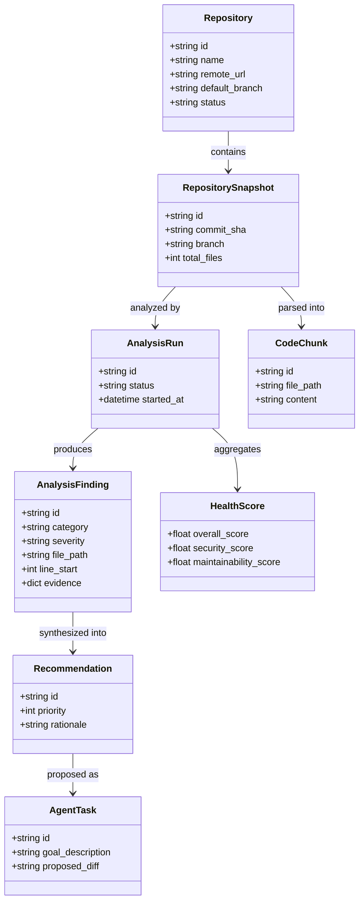

# Conceptual Domain Architecture

## 1. Domain Model Overview

CodeSentinel AI structures code intelligence around four core pillars:

## 2. Implemented Foundation (Phase 0)

In Phase 0, only the foundational entities required for repository registration and lifecycle tracking are persisted in the database:
* `Base`: Declarative Base with `TimestampMixin` (`created_at`, `updated_at`).
* `Repository`: Foundational table mapped via SQLAlchemy with migration `0001_initial`.

## 3. Future Architectural Entities

The following contracts are formalized in `backend/app/schemas/domain.py`:

### Ingestion & Repository
* **`RepositorySnapshot`**: Immutable point-in-time commit representation.
* **`RepositoryFile`**: Discovered source files, language attribution, hash digests.

### Deterministic Analysis
* **`AnalysisRun`**: Execution record of automated static analyzers and linters.
* **`AnalysisFinding`**: Individual verified issue (SAST, complexity, bug pattern) with file path, line numbers, and rule metadata.
* **`HealthScore`**: Weighted deterministic multidimensional score (security, maintainability, tests, documentation, dependencies).
* **`Dependency`**: Parsed package manifests (`package.json`, `requirements.txt`, `Cargo.toml`), ecosystem, licenses, and CVE IDs.
* **`TestMetric`**: Test suites, test pass/fail counts, code coverage metrics.
* **`SecurityFinding`**: CWE/CVE-correlated vulnerabilities with exact code evidence.

### Knowledge Representation
* **`CodeChunk`**: Syntactically coherent code chunks (classes, functions, methods).
* **`CodeEmbedding`**: Dense vector representation mapped to embedding model IDs.

### AI Reasoning & Agency
* **`AIConversation`**: Grounded chat context tied to specific repository snapshots.
* **`Recommendation`**: Synthesized priority actions referencing underlying findings.
* **`AgentTask`**: Auditable proposal for code modification containing concrete diffs, target files, and automated validation scripts.
