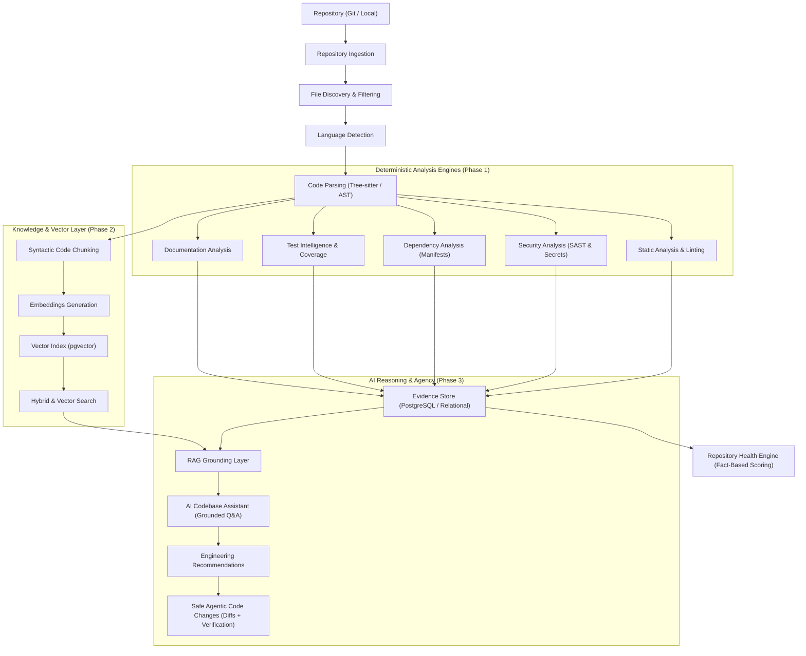

# Future Architecture & Intelligence Pipeline

## 1. Complete End-to-End Execution Pipeline

CodeSentinel AI processes a software repository through a staged, evidence-grounded execution pipeline:

## 2. Stage Breakdown

### Stage 1: Ingestion & Parsing
* **Repository Ingestion**: Clones repository or accesses local filesystem safely without executing untrusted code.
* **File Discovery**: Traverses directory tree respecting `.gitignore`, binary file exclusions, and vendor bundles.
* **Language Detection**: Classifies languages per file.
* **Code Parsing**: Generates Concrete/Abstract Syntax Trees using Tree-sitter parsers.

### Stage 2: Deterministic Intelligence
* **Static Analysis**: Identifies complexity, maintainability, architectural violations, and dead code.
* **Security Analysis**: Discovers hardcoded credentials, injection vulnerabilities, and known CVEs.
* **Dependency Intelligence**: Audits lockfiles for outdated or vulnerable packages.
* **Test Intelligence**: Gathers test runner logs, maps test files to source modules, checks branch coverage.
* **Documentation Analysis**: Evaluates docstring completeness and public API documentation.
* **Evidence Store**: Writes all immutable findings with source line ranges and rule IDs to PostgreSQL.
* **Repository Health Engine**: Computes verifiable health scores based on deterministic facts, never AI estimation.

### Stage 3: Semantic Representation
* **Syntactic Code Chunking**: Chunks along function, class, and method boundaries rather than arbitrary line slices.
* **Embeddings & Vector Index**: Stores dense embeddings linked to AST symbol identifiers in PostgreSQL (`pgvector`).

### Stage 4: Grounded AI Reasoning & Safe Agency
* **RAG Grounding Layer**: Assembles relevant evidence packets and source chunks.
* **AI Codebase Assistant**: Answers developer questions with verifiable citations.
* **Prioritized Recommendations**: Synthesizes and groups findings by ROI and severity.
* **Safe Agentic Proposals**: Proposes minimal diffs with automated test execution suites; never merges without user validation.
